# 좋아하면 누르는

<h1 align="center" style="max-width: 100%;">
  <br/>
</h1>

<table>
  <tbody>
    <tr>
      <td>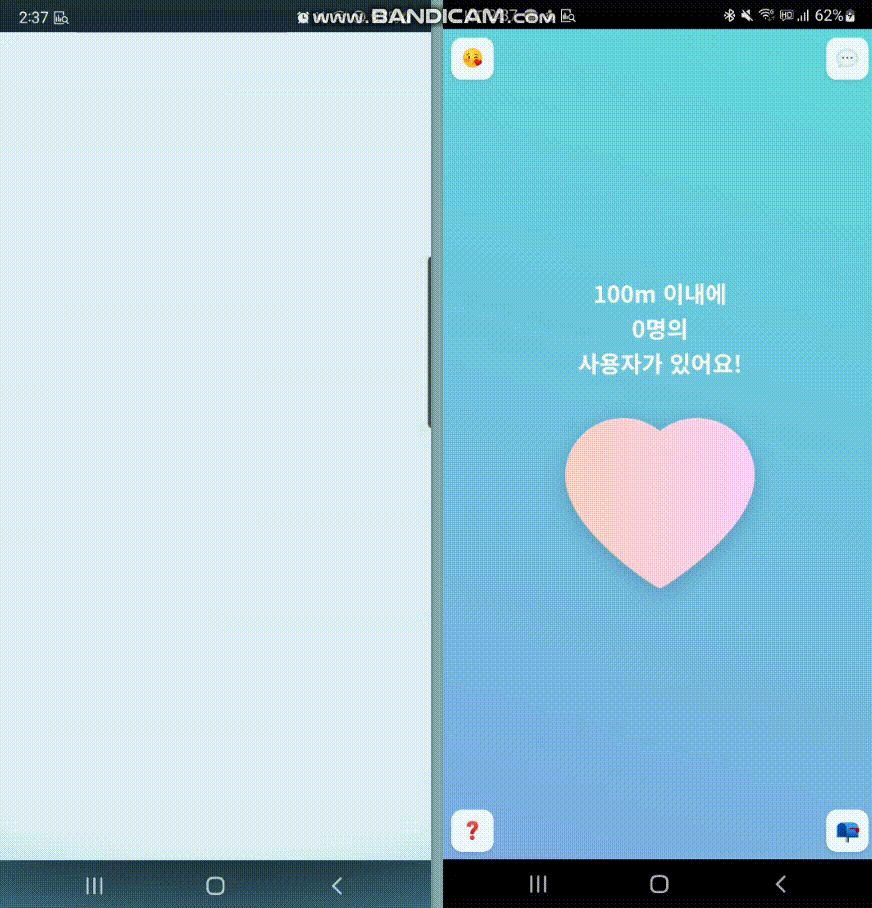</td>
      <td>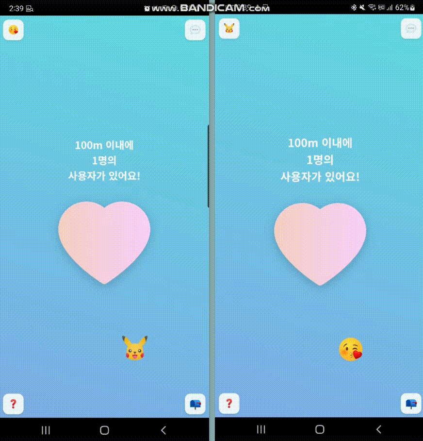</td?>
    </tr>
    <tr>
      <td>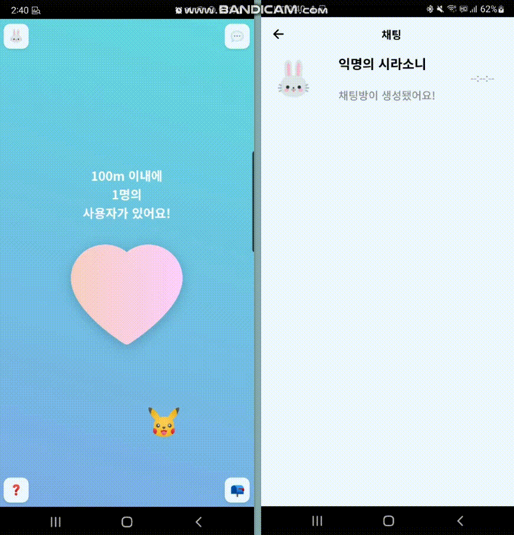</td>
      <td></td>
    </tr>
  </tbody>
</table>

<p align="center">
  <b>Supported</b><br/>
  <a href="#"></a>&nbsp;&nbsp;
    <a href="#"></a>&nbsp;&nbsp;
  <a href="#"></a>&nbsp;&nbsp;
  <a href="#"></a>&nbsp;&nbsp;
  <a href="#"></a>&nbsp;&nbsp;
    <a href="#"></a>&nbsp;&nbsp;
    <a href="#"></a>&nbsp;&nbsp;
    <a href="#"></a>&nbsp;&nbsp;
    <a href="#"></a>&nbsp;&nbsp;
  <a href="#"></a>&nbsp;&nbsp;
    <a href="#">

## 💁 개요

### 다운로드 및 실행

웹 : www.someone-might-like-you.com

안드로이드 : https://play.google.com/store/apps/details?id=com.nianticlabs.pokemongo

아이폰 : https://play.google.com/store/apps/details?id=com.nianticlabs.pokemongo

<br>

<table style="table-layout: fixed; overflow-wrap: break-word;">
  <tbody>
    <tr>
      <td colspan="2"><a href="#" target="_blank"></a></td>
    </tr>
  </tbody>
</table>

<h1 style="text-align:center" >
   익명 속에서 설렘을
</h1>
<h3 style="text-align:center">
  <br>
  주변 100m 이내의 사용자들은 서로의 위치를 공유합니다 <br><br>
  하트를 송수신 할 수 있으며, 하트가 매칭된 사용자들은 1:1 채팅이 자동으로 생성합니다 <br><br>
  이모지 변경, 유저 신고 등 부가적인 기능을 제공합니다
</h3>
<br>

## 💁 Release History

<h3 style="text-align:center;">
  22.05.21 - 앱스토어 출시</h3>  <h5  style="text-align:center;"><br></h5>

<h3 style="text-align:center;">
  22.05.20 - 플레이스토어 출시</h3>  <h5  style="text-align:center;"><br></h5>

<h3 style="text-align:center;">
  22.05.13 - Web 2차 배포</h3>  <h5  style="text-align:center;">안내 템플릿 <br> 건의함 <br> 위치 엑세스 허용 안내 <br> 이모지 변경 <br></h5>
<h3 style="text-align:center;">
  22.05.06 - Web 최초 배포</h3>
 <h5  style="text-align:center;"> 사용자간 위치 공유 <br> 하트 송수신 <br> 채팅 <br> 유저 신고 <br></h5>

## 🛠 아키텍처

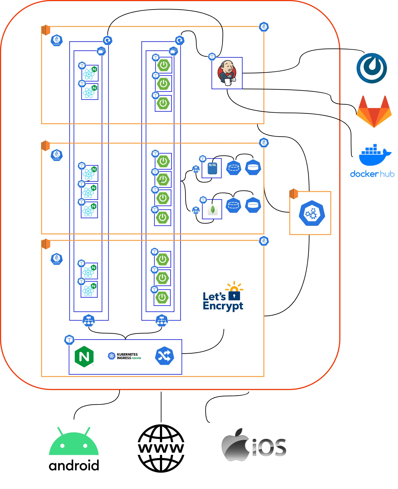

## 🛠 기술 스택

### 💎 **Front-end**

|  |  |  |
| :----------------------------------------------------------------------------------------------------------------------------: | :--------------------------------------------------------------------------------------------------------------------------: | :-----------------------------------------------------------------------------------------------------------------------------: |
|                                                             HTML5                                                              |                                                             CSS3                                                             |                                                           javascript                                                            |

|  | Stomp | TypeScript |
| :-------------------------------------------------------------------------------------------------------------------------------: | :---: | :--------: |
|                                                               React                                                               | Stomp | TypeScript |

### 🚀 **Back-end**

|  |  |  |  |  |
| :--------------------------------------------------------------------------------------------------------------------------: | :---------------------------------------------------------------------------------------------------------------------------------------------: | :-----------------------------------------------------------------------------------------------------------------------------------: | :---------------------------------------------------------------------------------------------------------------------------------------------------: | :--------------------------------------------------------------------------------: |
|                                                             Java                                                             |                                                                   Spring-Boot                                                                   |                                                              Spring-JPA                                                               |                                                                    Spring-Security                                                                    |                                        JWT                                         |

### 🚊 DB

|  |  |
| :----------------------------------------------------------------------------------------------------------------------------: | :--------------------------------------------------------------------------------------------------------------------------------------------------------------------------------------------: |
|                                                             MySQL                                                              |                                                                                            Mongodb                                                                                             |

### 🐬 **DevOps**

|  |  |  |  |  |
| :-------------------------------------------------------------------------------------------------------------------: | :------------------------------------------------------------------------------------------------------------------------------: | :------------------------------------------------------------------------------------------------------------------------------: | :------------------------------------------------------------------------------------------------------------: | :-----------------------------------------------------------------------------------------------------------------------------------------------------------------------------------------------------: |
|                                                         NGiNX                                                         |                                                               aws                                                                |                                                              docker                                                              |                                                    Jenkins                                                     |                                                                                               Kubernetes                                                                                                |

### 💡 기획 및 운영

|  |  |  |  |  |  |
| :-------------------------------------------------------------------------------------------------------------------------------------------------------------: | :------------------------------------------------------------------------------------------------------------------------------------------------------------------------------------------: | :---------------------------------------------------------------------------------------------------------------: | :---------------------------------------------------------------------------------------------------------------------------------: | :-----------------------------------------------------------------------------------------------------------------------------------------------------------------: | :------------------------------------------------------------------------------------------------------------------------------------------------------------------: |
|                                                                               Git                                                                               |                                                                                             JIRA                                                                                             |                                                       Figma                                                       |                                                               Notion                                                                |                                                                             Mattermost                                                                              |                                                                               Discord                                                                                |

### 📱 App

|  |  |  |  |
| :--------------------------------------------------------------------------------------------------------------------------------------------------------: | :------------------------------------------------------------------------------------------------------------------------------------------: | :----------------------------------------------------------------------------------------------------------------------------------------------------: | :---------------------------------------------------------------------------------------------------------------------------------------------------------------------------------------------: |
|                                                                           Kotlin                                                                           |                                                                Android Studio                                                                |                                                                         Swift                                                                          |                                                                                              Xcode                                                                                              |

## 💞 팀 & 기술

<table>
<tr>
  <td valign="top" width="50%">
    <a href="https://github.com/eora21">
      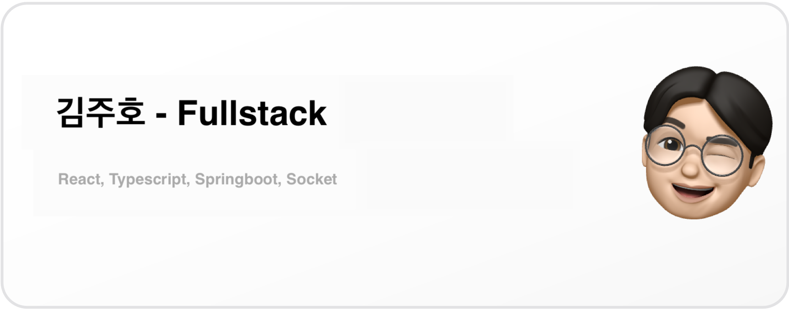
    </a>
  </td>
  <td valign="top" width="50%">
    <a href="https://github.com/glowforever42">
      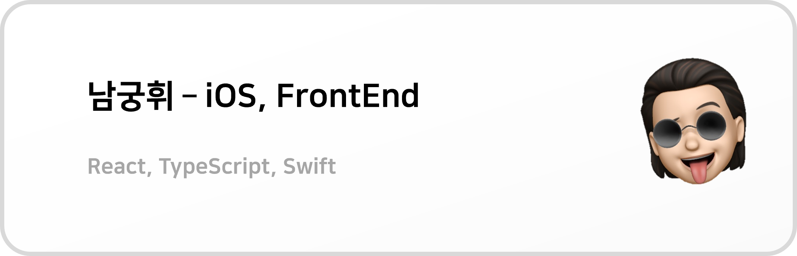
    </a>
  </td>
</tr>
<tr>
  <td valign="top" width="50%">
    <a href="https://github.com/82surf">
      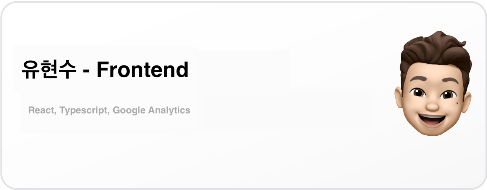
    </a>
  </td>
  <td valign="top" width="50%">
    <a href="https://github.com/Gkuer">
      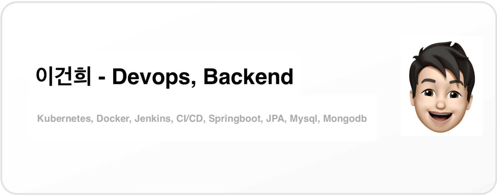
    </a>
  </td>
  </tr>
  <tr>
    <td valign="top" width="50%">
    <a href="https://github.com/EuneeChung">
      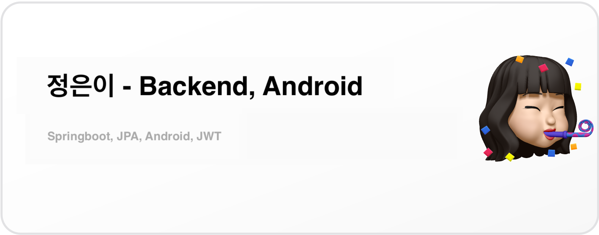
    </a>
  </td>
  <td valign="top" width="50%">
    <a href="https://github.com/gkstmdgns422">
      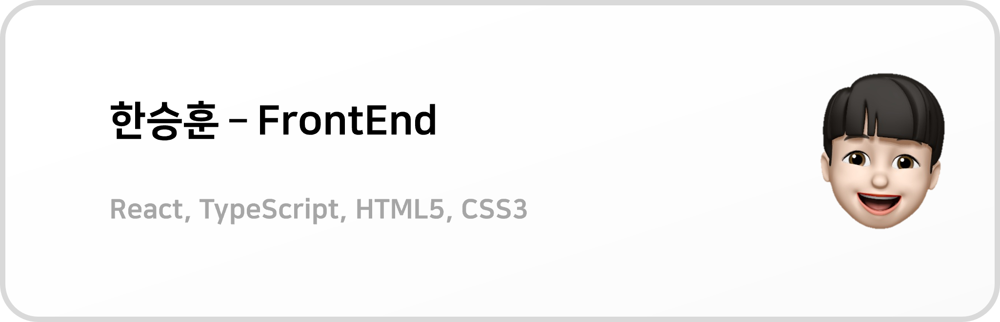
    </a>
  </td>
</tr>
</table>


#### 🖥️ 주요 Stack

|                           Content                            |          Main           |                          Detail                          |
| :----------------------------------------------------------: | :---------------------: | :------------------------------------------------------: |
| [**위치 공유**](#Section1, 김주호 - 위치 기반 기술과 채팅에 대하여) |   Spring / TypeScript   |             Socket / SockJS / Stomp / Axios              |
|              [**하트 송수신 및 채팅**](#드로잉)              |   Spring / TypeScript   |             Socket / SockJS / Stomp / Axios              |
|                      [**위치 공유**]()                       | HTML / CSS / JavaScript |            Django 3.2.9 / HTML5 / CSS3 / ES6             |
|            [**Kubernetes**](#색채-데이터-만들기)             | C# .Net Framework 4.7.2 |            C#(OpenCvSharp4 - V4.5.3.20210817)            |
|    [**파이프라인 구축**](#알고리즘-구성-및-웹페이지-작업)    |      Python 3.9.6       |                       Python(Math)                       |
|                       [**CI/CD**](#db)                       |      Python 3.9.6       |                    Python(Shell_plus)                    |
|              [**Ingress Nginx**](#query-최적화)              |      Django 3.2.9       |      prefetch_related / annotate / filter / exclude      |
|                      [**배포**](#배포)                       |           AWS           | EC2(Ubuntu Server 20.04 LTS) / Cloud9 / Gunicorn / NGINX |
|                                                              |                         |                                                          |
|                                                              |                         |                                                          |
|                                                              |                         |                                                          |
|                                                              |                         |                                                          |
|                                                              |                         |                                                          |
|                                                              |                         |                                                          |
|                                                              |                         |                                                          |
|                                                              |                         |                                                          |
|                                                              |                         |                                                          |
|                                                              |                         |                                                          |
|                                                              |                         |                                                          |
|                                                              |                         |                                                          |

# ⚙️ Individual Tech Section

## 🏃 Section1, 김주호 - 위치 기반 기술과 채팅에 대하여

> BE: Springboot Websocket
>
> FE: sockjs-client@1.6.0 / @stomp/stompjs@6.1.2 / @types/sockjs-client@1.5.1 / @types/stompjs@2.3.5

#### 어떻게 근처 유저들을 얻어올 것인가?

제일 쉬운 방법은, 내 위치를 중심으로 모든 유저들과의 거리를 계산 후 100m 이내인 유저를 걸러내면 된다.

허나 이는 유저의 수가 많아지면 많아질수록 효율이 급감하며, 계속해서 유저들의 실시간 위치를 받아내야만 한다.

좋은 방법이 아닐 것 같아 많은 고민을 하던 중, [우아한 Tech 분산 이벤트 스트리밍](https://youtu.be/PvAlbOm9WN8?t=5516) 영상과 [카카오의 W3W](https://kakaomap.tistory.com/238)에서 영감을 얻어 전 세계를 정해진 크기의 구획으로 나눈 후 내 구획을 기준으로 주변의 구획 데이터를 얻어오면 될 것 같았다.

해당하는 방식이라면 주변 구획에 접근하여 유저 목록을 생성할 수 있으니, 굉장히 좋은 방법이라 생각했다.

아쉽게도 카카오의 W3W나 일반 [W3W](https://developer.what3words.com/public-api/docs)가 근처 구획만을 생성, 획득하는 방법으로는 방향성이 맞지 않다고 느껴졌기 때문에, **직접 gps 데이터를 계산하여 구획을 생성하는 방식**을 채택하였다.

#### gps data -> sector data?

보통 gps 데이터를 수신할 경우, 37.xxxxxxx, 127.xxxxxxx 의 값을 가져오게 된다.

해당하는 값을 하나의 구획으로 바꾸어야 한다. 구획은 몇 m로 세팅해야 하며, 손 쉽게 나눌 수 있는 방법은 무엇이 있을까?

우선 1m가 gps상에서 몇 차이가 나는지 확인해 보았다. [해당 글을 참고](https://m.cafe.daum.net/gpsyn/Pllz/530)하자면, 0.00001도 차이가 대략 1m라 한다. 정확하게는 물론 아니겠지만, 해당 방법으로 전 세계 구획을 나눈 후 작업해도 괜찮을 것 같다는 생각을 했다. 그러나 더욱 정확한 계측을 위해, [두 지역 사이의 거리를 측정해 주는 사이트](http://www.movable-type.co.uk/scripts/latlong.html)를 찾아갔다.

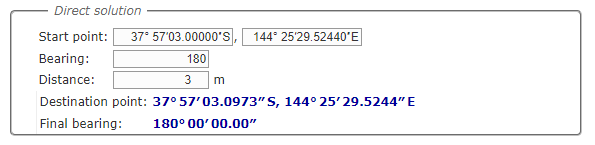

해당 사이트의 계산에 의하면, `3m`는 도분초 좌표계 기준으로 `0.0973초`만큼 차이가 있었다.


`0.1초` 차이는 `3.083m`만큼 차이가 났으며, `1초` 차이는 `30.83m`차이였다.

그렇다면, gps 데이터를 수신한 후 도분초 좌표계로 변환하고, 소수점을 제외한 데이터를 구획으로 삼으면 되지 않을까 하는 생각이 들어 바로 착수했다. 정확히 100m는 어렵겠지만, 대략적인 100m 데이터를 얻을 수 있으므로..

#### Sector 구현

지구의 모든 구역을 30m \* 30m 2차원 배열로 만들기에는 메모리 낭비가 너무 크다. index도 계산해줘야 하는 이슈가 있으므로 HashMap을 만든 후 gps 구획 데이터를 key로 들고 있기로 했다.

비로그인 사용자도 이용할 수 있어야 하므로 소켓 세션 id를 해당 구획 value의 key로 잡고, pk와 이모지URL을 value로 지니고 있게끔 했다.

```json
{
  "36/21/101/127/20/583": {
    "5ubuuxi3": {
      "pk": 1,
      "emojiURL": "emoji"
    }
  }
}
```

또한 유저가 이동해 구획이 변경되거나 로그인 등으로 이모지가 변경된다면 basic 채널에 메세지를 전송하여 모든 유저가 알 수 있게끔 메세지를 보내도록 했다. 이는 스케쥴러를 사용하였다.

```java
@Scheduled(fixedRate = 5000)
public void sendBasicChat() {
    if (gpsRepository.getOperationCommand()) {
        messageTemplate.convertAndSend("/sub/basic", gpsRepository.getAllGpsSectorData());
        gpsRepository.setOffOperationCommand();
    }
}
```

소켓통신이 끊긴다면 해당하는 구획에서 데이터를 삭제해야 하므로, 소켓 연결 및 구획 변경 시마다 각각의 세션에 현재 구획을 들고 있다가, 끊길 경우 구획으로 접근해 해당하는 세션id값을 제거하도록 했다.

```java
@EventListener
public void handleSessionConnect(SessionConnectEvent event) {
    SimpAttributesContextHolder.currentAttributes().setAttribute("GPS", "");
}

@EventListener
public void handleSessionDisconnect(SessionDisconnectEvent event) {
    String gpsKey = (String) SimpAttributesContextHolder.currentAttributes().getAttribute("GPS");
    String sessionId = event.getSessionId();
    gpsRepository.dropUser(gpsKey, sessionId);
}
```

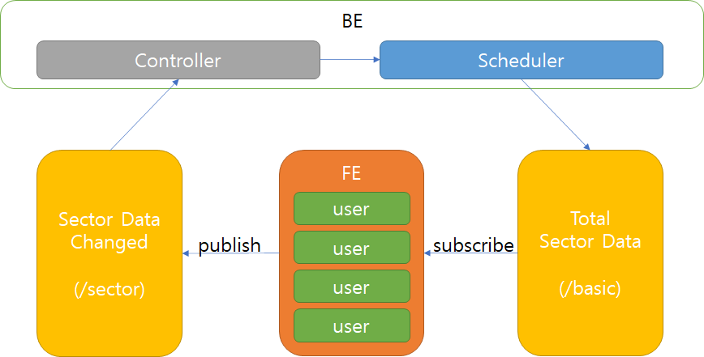

대략 해당 그림과 같은 구조가 만들어진다.

#### 채팅 시스템을 이용한 근처 유저들과 하트 송수신 및 채팅방 구현

100m 이내 유저들을 얻어 왔으므로, 하트 버튼을 누른다면 각각의 유저에게 메세지를 보내는 방법으로 구성하였다. 비로그인 사용자들도 하트를 얻을 수 있도록, sessionId를 얻어와 해당 채널을 subscribe한 후, 하트 메세지를 받으면 이벤트를 호출하도록 했다.

```tsx
const sessionId = (
    (client.webSocket as any)._transport.url as string
).split('/')[6];

...

client.subscribe(`/sub/heart/${sessionId}`, (message) => {
    const whisper: whisper = JSON.parse(message.body);
    changeSignal();
    receiveMessageDispatch(whisper);
});
```

`changeSignal`에서는 단순 boolean 값을 true, false로 바꿔주어 하트를 받았는지 아닌지 확인하게끔 했으며, `receiveMessageDispatch`를 통해 하트를 전송한 유저와의 관련성을 체크한다. 만약 하트가 교환되었으면서 채팅방이 미생성된 유저라면, 채팅방 생성 api에 접근하여 채팅방을 신설한 후 양쪽 유저에게 채팅방 생성 알림을 보낸다.

FE에서 채팅방 생성 알림이 수신되면, 생성된 채팅방을 목록에 추가한 후 방의 pk로 subscribe를 수행한다. Stomp 특성 상 subscribe와 함께 어떠한 동작을 할 지 Callback을 지정해줘야 하기 때문에 한 번에 작성하였다. 그러나 이 둘을 따로 분리시켜 `구독 / 구독이벤트` 형태로 구축했으면 좀 더 가독성이 좋은 코드가 되지 않았을까 싶다.

```tsx
if (!chatUserSet.has(action.person)) {
  chatUserSet.add(action.person);
  setAlertText("채팅방이 생성되었습니다!");
  openAlert();
  const newChatRoom: chatBox = {
    chatroomSeq: action.chatRoom,
    userList: [seq, action.person],
    activate: true,
  };
  setChatRoomList((pre) => [newChatRoom, ...pre]);

  chatsDispatch({
    type: "INSERT",
    idx: action.chatRoom,
    messages: new Array<messageType>(),
    messageType: {} as messageType,
  });

  client.subscribe(`/sub/chat/room/${action.chatRoom}`, (message) => {
    setMessageCount((pre) => {
      pre[action.chatRoom] += 1;
      return pre;
    });

    chatsDispatch({
      type: "CHAT_MESSAGE",
      idx: action.chatRoom,
      messages: [],
      messageType: JSON.parse(message.body) as messageType,
    });
  });
}
```

방 내부에서는 채팅방의 데이터를 담아 publish를 수행한다. BE에서는 한 곳에 채팅 메세지를 받고, 데이터에 따라 어떠한 채팅방에 어떻게 전달할 것인지를 선택하는 구조로 하였다.

```tsx
client.publish({
  destination: "/pub/chat/message",
  body: JSON.stringify({
    type: "TALK",
    roomId: `${idx}`,
    sender: `${seq}`,
    message: `${message}`,
  }),
});
```

```java
@MessageMapping("chat/message")
    public void message(ChatMessageDTO message) {
        switch (message.getType()) {
            case TALK:
                chatService.CreateChat(message);
                break;
            ...
        }
    }
```

```java
@Transactional
public void CreateChat(ChatMessageDTO DTO) {
    String pattern = "yyyy-MM-dd a KK:mm ss:SSS";
    DateFormat df = new SimpleDateFormat(pattern);
    ChatEntity chatEntity = ChatEntity.builder()
        .type(DTO.getType())
        .roomId(DTO.getRoomId())
        .sender(DTO.getSender())
        .message(DTO.getMessage())
        .sendTime(df.format(new Date()))
        .build();
    chatRepository.save(chatEntity);
    messageTemplate.convertAndSend("/sub/chat/room/" + DTO.getRoomId(), chatEntity);
}
```

해당하는 방법으로 100m 이내 유저를 얻어왔으며, 하트를 교환하고 채팅을 나눌 수 있도록 하였다.

## ✨ Section2, 남궁휘 -

## 👑 Section3, 유현수 - Google Analytics

### Google Analytics 적용하기

> react-ga 라이브러리를 사용해 React에 Google Analytics(이하 GA)를 적용하는 방법

#### GA 계정 생성

- [Google Analytics](https://analytics.google.com) 사이트에 접속해 계정을 생성합니다.
- 속성 설정 > 고급 옵션 보기 > **유니버설 애널리틱스 속성만 만들기 를 선택**합니다.
  - **react-ga 라이브러리가 UA(유니버설 애널리틱스)만 지원하기 때문**입니다.
- 계정 생성이 완료되면 "UA-XXXX" 포맷의 추적 ID를 확인합니다.

#### react-ga 설치

> 주의사항: 22/05/02 기준 react-ga는 react v17까지만 지원합니다.

아래 명령어로 `react-ga` 라이브러리를 설치할 수 있습니다.

```bash
# npm
$ npm install react-ga
```

#### useGA 커스텀 훅 만들기

`ReactGA.initialize` 시 앞에서 확인한 추적 ID를 적용합니다.

```javascript
// hooks/useGA

import { useState, useEffect } from "react";
import { useLocation } from "react-router-dom";
import ReactGA from "react-ga";

const useGA = () => {
  const location = useLocation();
  const [initialized, setInitialized] = useState(false);

  // 개발환경이 아닐 경우에만 GA initialize
  useEffect(() => {
    if (!window.location.href.includes("localhost")) {
      ReactGA.initialize(`${process.env.REACT_APP_GA_TRACKING_ID}`);
    }
    setInitialized(true);
  }, []);

  // GA initialize가 되어있다면 pageview 전송
  useEffect(() => {
    if (initialized) {
      ReactGA.pageview(location.pathname + location.search);
    }
  }, [initialized, location]);

  /*
   * GA 디버깅용 코드
   * 개발환경에서도 GA initialize.
   * debug 옵션이 설정되어 console에 트래킹 정보를 출력.
   */
  // useEffect(() => {
  //   ReactGA.initialize(`${process.env.REACT_APP_GA_TRACKING_ID}`, {
  //     debug: true,
  //   });
  //   ReactGA.pageview(location.pathname + location.search);
  // }, [location]);
};

export default useGA;
```

#### GARoutes 컴포넌트 만들기

`react-router-dom`의 `useLocation` hook은 Router 내부에서만 동작하는 hook입니다.
때문에 `useGA` 훅을 바로 `App.js`에 적용하면 에러가 발생합니다.
이를 방지하기 위해 `useGA` 훅을 사용하는 커스텀 `Router` 컴포넌트를 만들어 사용합니다.

```javascript
// components/GARoutes

import { ReactNode } from "react";
import { Routes } from "react-router-dom";

import useGA from "../hooks/useGA";

const GARoutes = ({ children }: { children: ReactNode }) => {
  useGA();
  return <Routes>{children}</Routes>;
};

export default GARoutes;
```

이렇게 만든 `GARouter` 컴포넌트를 `App.tsx`에 적용합니다.

```javascript
// App.tsx

import GARoutes from "./components/GARoutes";

function App() {
  return (
    <BrowserRouter>
      <GARoutes>
        <Route path="/" element={<IndexPage />} />
        <Route path="/info" element={<InfoPage />} />
      </GARoutes>
    </BrowserRouter>
  );
}

export default App;
```

#### GA 이벤트 추적하기

[`ReactGA.event(args)`](https://github.com/react-ga/react-ga#reactgaeventargs) API를 사용해 이벤트를 추적할 수 있습니다. `category`, `action`는 필수로 입력해야하는 인자입니다.
이벤트 핸들러 내부에 작성하면 해당 이벤트를 추적합니다.

```javascript
// Home.tsx

...
const heartClickHandler = () => {
    ReactGA.event({
      category: '하트 버튼 클릭',
      action: '하트 버튼 클릭',
    });
    updatePushHeart();
    sendHeart();
  };
...
```

## 🗳️ Section4, 이건희 - 쿠버네티스, 도커, 젠킨스를 활용한 배포와 CI/CD에 대하여

## 🛡️ Section5, 정은이 - 위치 기반 기술과 채팅에 대하여

## ❣ Section6, 한승훈 - React-slick & styled-component

### React-slick 이란?

> 리액트에서 대중적으로 쓰이는 jQuery slick 라이브러리로 캐러셀을 만들때 주로 사용한다. 

#### 설치 방법

```bash
$ npm install react-slick
```

#### 사용방법

> slider를 import하고 settings를 설정한뒤, Slider 내부에 settings를 넣으면 실행된다.

```react
// 공식 문서의 일부
import Slider from "react-slick"; // slider 불러오기

// styled-component를 사용할때 필요한 import문
import 'slick-carousel/slick/slick.css'; 
import 'slick-carousel/slick/slick-theme.css';

const settings = {
    dots: true, // 컨텐츠 이동 버튼
    infinite: true, // 슬라이드의 마지막 부분과 처음부분을 이어 무한 재생
    speed: 500, // 넘기는 속도
    slidesToShow: 1, // 한 화면에 보이는 갯수
    slidesToScroll: 1 // 한번에 넘어가는 컨텐츠 수
    arrows: false, // 양옆 이동 화살표
  	beforeChange: (current: any, next: any) => setState(next), // 현재 센터 번호를 지정
};

<Slider {...settings}>
    <div>
      <h3>1</h3>
    </div>
</Slider>
```

#### 이모지 캐러셀 중앙 값만 크기 키우기

> 공식 문서에 나온 캐러셀은 내부가 정해져 있기에 자신이 원하는 곳마다 꾸미기가 가능하였다.
>
> 그러나 우리가 사용하는 캐러셀 내부는 이모지를 모두 불러와 나눠주기에 하나하나 수정이 불가능하였으며
>
> 공식문서에도 따로 알려주는 것이 없었다. 그렇기에 코드 해부와 중앙 및 양옆의 값을 구분해서 css를 다르게
>
> 설정하였다.

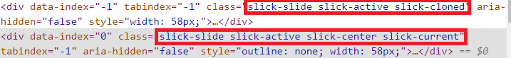

> 실제 캐러셀을 개발자 모드로 분석한 결과 중앙과 앙옆의 클래스가 구분되어 지정되어 있었다. 그렇기에 
>
> slick-center, slick-current로 중앙을 구분하였다. 

```react
.slick-current {
  transform: scale(1.6) // 크기를 1.6배로 확대
}
```

> css를 위와 같이 설정함으로써 가운데 이모지의 크기를 확대하여 3d형태로 표현하였다.


#### 이모지 좌우 움직임 및 화면 너비 & 높이별 이모지 크기 조절

> 이모지 좌우 움직임은 css animation을 활용

```react
animation-name: move; // 애니메이션 종류 (@keyframes이름)
animation-duration: 10s; // 구동 시간
animation-fill-mode: both; // 애니메이션을 전과 후에 스타일을 적용
animation-timing-function: linear; // 애니메이션 진행 방식
animation-iteration-count: infinite; // 애니메이션을 얼마나 재생할지
animation-direction: alternate; // 방향 설정
@keyframes move {
  from {
    transform: translateX(-250px); // -250px 부터 시작
  }
  to {
    transform: translateX(250px); // 250px 까지 이동
  }
}
```

> 핸드폰마다 너비, 높이가 다르기에 location page에서 이모지가 작거나 넘처흐르는 현상을 수정해야 했다.
>
> 따라서, @media를 활용하여 이모지 크기를 변경하였다.

```
@media (max-height: 450px) {
  width: 20px;
  height: 20px;
}
@media (min-height: 1100px) {
  width: 100px;
  height: 100px;
}
@media (min-height: 800px) {
  width: 80px;
  height: 80px;
}
```


### styled-component (CSS in JS)

#### styled-component란?

> 리액트에서 가장 많이 사용되고 있는 css in js방식으로 앱에 맞는 CSS 라이브러리이다.
>
> 대표적인 장점으로 코드가독성, 재사용성, props 전달 가능이 있다.

#### 설치 방법

```bash
$ npm install styled-components
```

#### 사용방법

> styled를 import하고 사용하고 싶은 태그를 커스텀마이징해서 사용하면 된다.

- 기본 태그의 css 설정
  - `const 컴포넌트명 = styled.태그명`
- 컴포넌트 상속
  - `const 컴포넌트명 = styled.상속명` 
  - 사용할때 `${props => css설정}`
- 변수명 변경
  - `const 컴포넌트명 = styled(기존 컴포넌트)`
- 스타일만을 위한 변수가 기본 React 노드로 전달되거나 DOM 요소로 렌더링되는 것을 방지하려면 변수 이름 앞에 `$` 기호를 붙이면 된다.

#### 예시문

```react
import styled from "styled-components";

const Example = () => {
    return (
      	<>
      		<Button>Hello</Button>
        	<NewButton color="blue">new Button</NewButton>
      	</>
  	);
}
// 기본 button태그 설정
const Button = styled.button`
  width: 200px;
  padding: 30px;
`;

// Button 컴포넌트 상속
const NewButton = styled.Button`
  color: ${props => props.color || "red"};
`;

export default Example;
```

