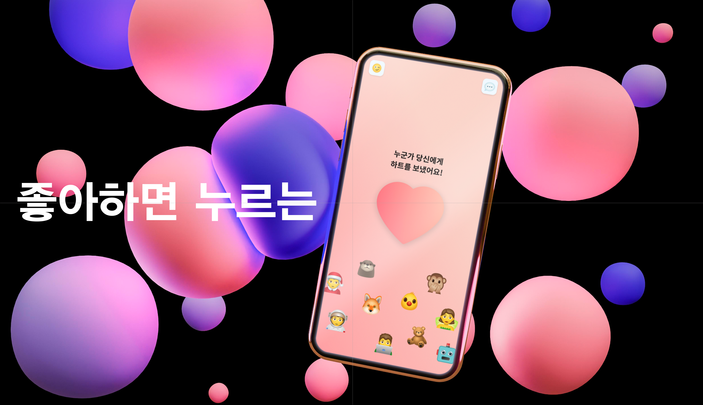

# 좋아하면 누르는

<h1 align="center" style="max-width: 100%;">
   
  <a href="https://www.prismfilmstudio.com">www.someone-might-like-you.com</a>
</h1>

  <b>Supported</b> 
  &nbsp;&nbsp;
  &nbsp;&nbsp;
    &nbsp;&nbsp;
  &nbsp;&nbsp;
  &nbsp;&nbsp;
  &nbsp;&nbsp;
    &nbsp;&nbsp;
    &nbsp;&nbsp;
    &nbsp;&nbsp;
    &nbsp;&nbsp;
  &nbsp;&nbsp;
    <a href="#">

 

## 💁 Release History

웹 : www.someone-might-like-you.com

안드로이드 : https://play.google.com/store/apps/details?id=com.nianticlabs.pokemongo

아이폰 : https://play.google.com/store/apps/details?id=com.nianticlabs.pokemongo

 

#### 22. 05.21 - 앱스토어 출시 (Web view)

#### 22.05.20 - 플레이스토어 출시 (Web view)

#### 22.05.13 - Web 2차 배포

* 안내 템플릿
* 건의함
* 위치 엑세스 허용 안내
* 이모지 변경

#### 22.05.06 - Web 최초 배포 (MVP)

* 사용자간 위치 공유

* 하트 송수신

* 채팅

* 유저 신고

  

 

## 목차

1. [**웹 서비스 소개**](#1)
1. [**기술 스택**](#2)
1. [**주요 기능**](#3)
1. [**개발 팀 소개**](#4)
1. [**개발 기간**](#5)

 
 

## 💁 웹 서비스 소개

**좋아하면 누르는** 은 익명으로 좋아하는 마음을 전하는 서비스입니다.
근처에 좋아하는 사람이 있다면 하트를 눌러보세요!
반경 10m 이내의 사람들에게 익명으로 하트가 전달됩니다 :D

 
 

## 🛠 기술 스택

### **Front-end**

|  |  |  |
| :----------------------------------------------------------------------------------------------------------------------------: | :--------------------------------------------------------------------------------------------------------------------------: | :-----------------------------------------------------------------------------------------------------------------------------: |
|                                                             HTML5                                                              |                                                             CSS3                                                             |                                                           javascript                                                            |

|  |  | Stomp |
| :-------------------------------------------------------------------------------------------------------------------------------: | :------------------------------------------------------------------------------------------------------------------: | :---: |
|                                                               React                                                               |                                                        Redux                                                         | Stomp |

### **Back-end**

|  |  |  |  |  |
| :--------------------------------------------------------------------------------------------------------------------------: | :---------------------------------------------------------------------------------------------------------------------------------------------: | :-----------------------------------------------------------------------------------------------------------------------------------: | :---------------------------------------------------------------------------------------------------------------------------------------------------: | :--------------------------------------------------------------------------------: |
|                                                             Java                                                             |                                                                   Spring-Boot                                                                   |                                                              Spring-JPA                                                               |                                                                    Spring-Security                                                                    |                                        JWT                                         |

|  |  |
| :----------------------------------------------------------------------------------------------------------------------------: | :--------------------------------------------------------------------------------------------------------------------------------------------------------------------------------------------: |
|                                                             MySQL                                                              |                                                                                            MongoDB                                                                                             |

### **DevOps**

|  |  |  |  |  |
| :-------------------------------------------------------------------------------------------------------------------: | :------------------------------------------------------------------------------------------------------------------------------: | :------------------------------------------------------------------------------------------------------------------------------: | :------------------------------------------------------------------------------------------------------------: | :-----------------------------------------------------------------------------------------------------------------------------------------------------------------------------------------------------: |
|                                                         NGiNX                                                         |                                                               aws                                                                |                                                              docker                                                              |                                                    Jenkins                                                     |                                                                                               Kubernetes                                                                                                |

### Version-Control

|  |  |
| :-------------------------------------------------------------------------------------------------------------------------------------------------------------: | :-----------------------------------------------------------------------------------------------------------------------------------------------: |
|                                                                               Git                                                                               |                                                                      GitLab                                                                       |

 
 

## 💡 주요 기능

|       기능        | 내용                                                               |
| :---------------: | ------------------------------------------------------------------ |
|   탕!♡ (TANG!♡)   | 근처(약 10m) 유저들에게 하트를 전송 합니다. GIVE LOVE.             |
|     하트 수신     | 서로 하트를 주고받은 유저가 있다면, 익명 채팅창이 자동 생성됩니다. |
|     익명 채팅     | 생성된 채팅창에서 채팅을 송수신할 수 있습니다.                     |
|     유저 차단     | 자신의 마음에 들지 않는 유저를 차단 할 수 있습니다.                |
|     유저 신고     | 서비스를 이용하면서 불쾌감을 주는 유저를 신고할 수 있습니다.       |
| 이모지 설정, 변경 | 나의 정체성을 드러내는 이모티콘을 설정, 변경 가능합니다.           |

 
 

## 👪 개발 팀 소개

<table>
  <tr>
    <td align="center" width="150px">
      
    </td>
    <td align="center" width="150px">
      
    </td>
    <td align="center" width="150px">
      
    </td>
    <td align="center" width="150px">
      
    </td>
    <td align="center" width="150px">
      
    </td>
    <td align="center" width="150px">
      
    </td>
  </tr>
  <tr>
    <td align="center">
      <a href="https://github.com/eora21" target="_blank">
        김주호 (FullStack)
      </a>
    </td>
    <td align="center">
      <a href="https://github.com/glowforever42" target="_blank">
        남궁휘 (Frontend)
      </a>
    </td>
    <td align="center">
      <a href="https://github.com/82surf" target="_blank">
        유현수 (Frontend & iOS)
      </a>
    </td>
    <td align="center">
      <a href="https://github.com/Gkuer" target="_blank">
        이건희 (Backend & DevOps)
      </a>
    </td>
    <td align="center">
      <a href="https://github.com/EuneeChung" target="_blank">
        정은이 (Backend & Android)
      </a>
    </td>
    <td align="center">
      <a href="https://github.com/gkstmdgns422" target="_blank">
        한승훈 (Frontend)
      </a>
    </td>
  </tr>
</table>

 

|  이름  |       역할        | 
개발 내용
 |
| :----: | :---------------: | :---------------------------------: |
| 김주호 |    Full Stack     |                                     |
| 남궁휘 |     Frontend      |                                     |
| 유현수 |  Frontend & iOS   |                                     |
| 이건희 | Backend & DevOps  |                                     |
| 정은이 | Backend & Android |                                     |
| 한승훈 |    Full Stack     |                                     |

 
 

## 📅 개발 기간

### 총 개발 기간 : 22.04.11 ~22.05.27

- #### v1.0.0 (Release) : 22.04.11 ~ 22.04.27

  - ##### MVP

    - 사용자간 위치 연결
    - 좋아요 교환
    - 1:1 채팅
