# 좋아하면 누르는 시연 시나리오

## 서비스 소개

| 주요 기능                                | 설명                                                         |
| ---------------------------------------- | ------------------------------------------------------------ |
| 🌍 주변 100m이내 접속 유저 위치 탐색 기능 | 주변 100m 이내의 사용자를 찾기 위해 위치 정보 동의를 받아야 합니다. |
| 💌 사용자 간의 하트 송수신                | 100m이내의 유저들과 하트를 주고 받을 수 있습니다. 만약 서로 하트를 주고받은 유저가 있다면, 익명 채팅창이 자동 생성됩니다. |
| 🐶 자신의 이모지 설정, 변경 기능          | 나의 정체성을 드러내는 이모지를 설정, 변경 가능합니다. 설정된 이모지로 다른 사용자 화면에 나타납니다. |
| 🙋‍♀️ 실시간 채팅 기능                      | 생성된 채팅방에서 채팅을 송수신할 수 있습니다.               |
| 🚨 유저 신고                              | 서비스를 이용하면서 불쾌감을 주는 유저를 신고할 수 있습니다. 신고 후 채팅방은 블라인드 처리되어 사용자들에게 제공되지 않습니다. |

## 목차

[1. location 위치 정보 동의](#1-location-위치-정보-동의)  
[2. About Service](#2-about-service)  
[3. Main](#3-main)  
[4. Emoji](#4-emoji)  
[5. Chatting](#5-chatting)  
[6. 건의함](#6-건의함)  
[7. 로그인&회원가입](#7-로그인-회원가입)  

## 1. location 위치 정보 동의

좋아하면 누르는 서비스는 위치 정보를 활용한 서비스이기에 유저의 위치 정보를 받아야 합니다. 

|  |  |  |
| ------------------------------------------------------ | -------------------------------------- | -------------------------------------- |
| 위치정보켜기버튼클릭                                   | 동의성공                               | 동의실패                               |

## 2. About Service

좌측 하단의 물음표 버튼을 클릭시 해당 서비스의 설명을 제공합니다.

| 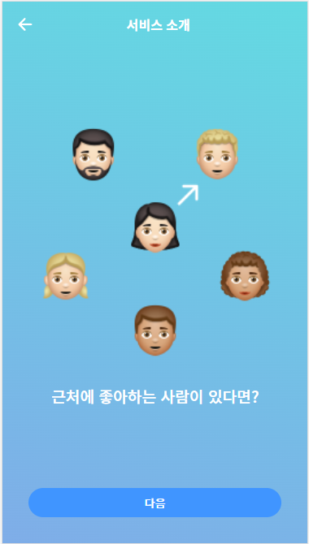 | 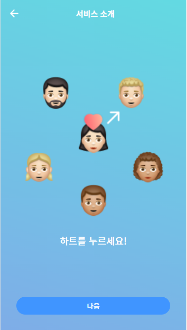 |  | 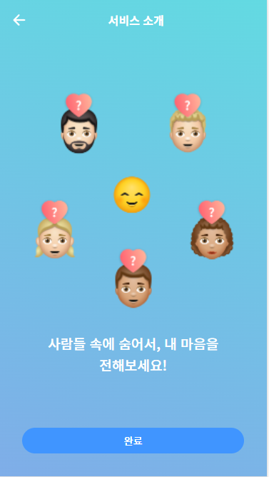 |  |
| ---------------------------------------- | ---------------------------------------- | ---------------------------------------- | ---------------------------------------- | ------------------------------------------ |

## 3. Main

유저는 비로그인 상태에서도 근처에 접속한 유저를 볼 수 있지만 메인 화면의 기능(채팅방, 이모지변경)을 사용하기 위해 로그인/회원가입이 필요합니다.

|                                  |  |  |
| ------------------------------------------------------------ | ------------------------------------------------------ | ------------------------------------------------------ |
| Main 화면 - 100m 이내의 사용자 수 만큼 설정된 이모지가 나타난다.  - 좌측 상단 : 이모지 변경 - 우측 상단 : 채팅방  - 좌측 하단 : 서비스 설명  - 우측 하단 : 건의함 | 하트 보냈다                                            | 하트를 받았다                                          |

## 4. Emoji

  나의 정체성을 드러내는 이모지를 설정, 변경 가능합니다. 설정된 이모지로 다른 사용자 화면에 나타납니다.

| 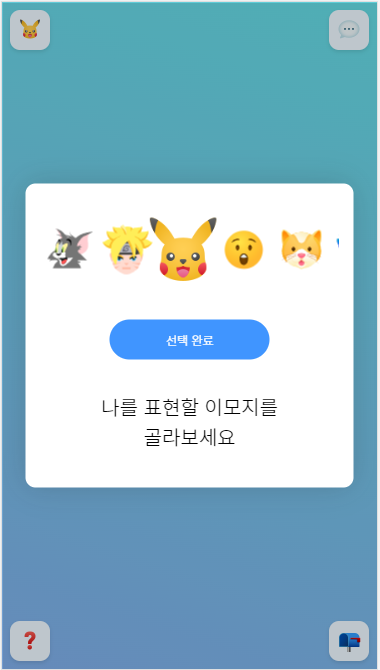             |  |
| ------------------------------------------------------ | ------------------------------------------------------------ |
| 원하는 이모지 선택 - 좌측 상단 본인의 이모지 표시 | 100m 이내의 다른 사용자에게 설정된 이모지로 등장             |

## 5. Chatting

하트를 주고 받았을 경우, 채팅방이 개설되고 이후 자유롭게 채팅을 할 수 있습니다. 악의적인 사용자를 우측 상단의 버튼을 통해서 신고할 수 있고 신고가 누적된 사용자는 서비스 이용이 불가할 수 있습니다. 신고 후 해당 채팅방은 이용이 불가한 상태로 바뀌게 됩니다.

| 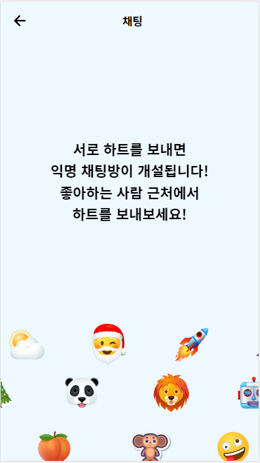                   | 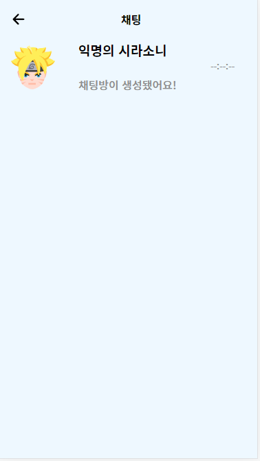 | 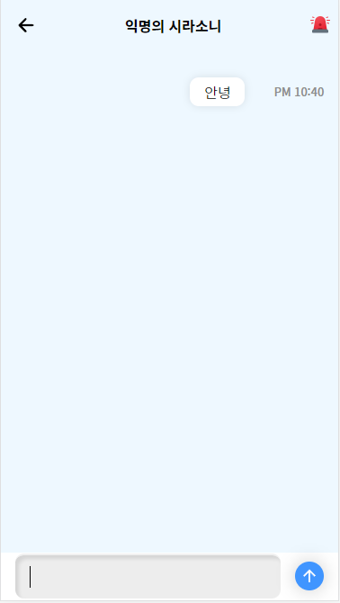 | 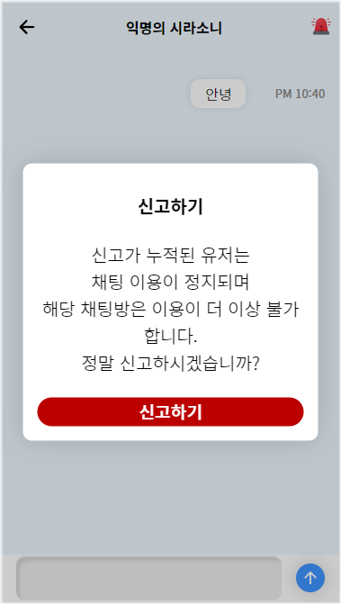 |
| ------------------------------------------------------------ | ------------------------------------------ | -------------------------------------------- | ------------------------------------------ |
| 채팅방 로비  - Main 화면에서 우측 상단 말풍선 버튼을 누르면 이 화면으로 이동 | 하트를 주고 받을 시에 채팅 개설            | 채팅 송수신                                  | 악성 유저 신고                             |

## 6. 건의함

| 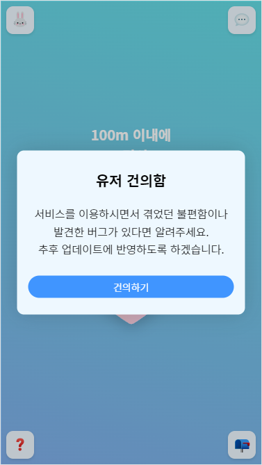                           | 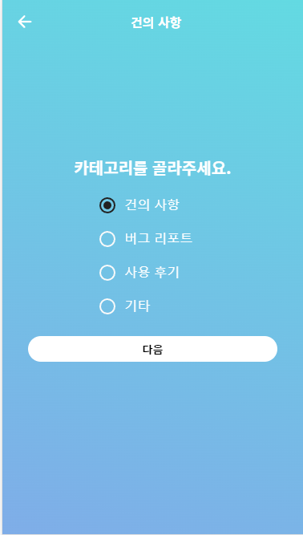 | 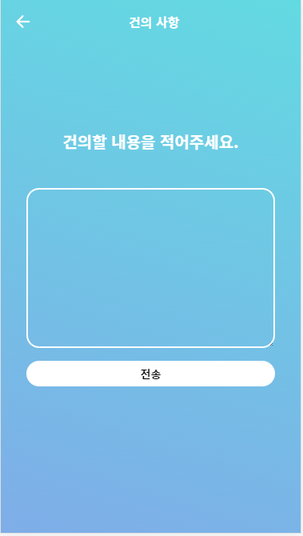 | 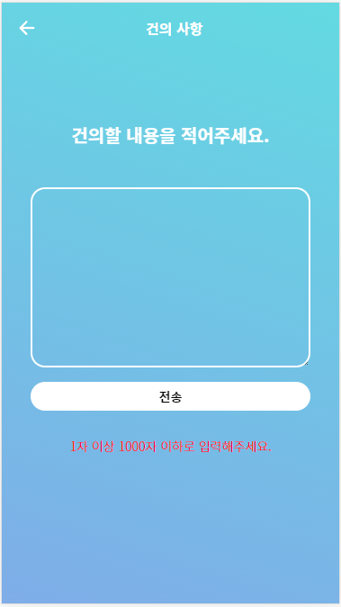 | 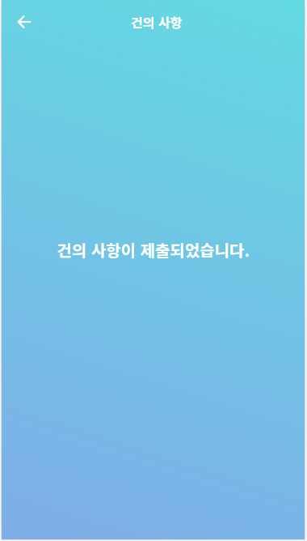 |
| ------------------------------------------------------------ | ------------------------------------------------------ | ---------------------------------------------- | ------------------------------------------------------ | -------------------------------------- |
| 건의함 - Main 화면에서 우측 하단 우편함 버튼 클릭시 이동 | 건의 카테고리 설정                                     | 건의사항 입력                                  | 입력 조건 안내                                         | 제출 완료                              |

## 7. 로그인-회원가입

로그인이 필요한 서비스를 누를 시에 로그인 팝업 화면이 나타납니다.

| 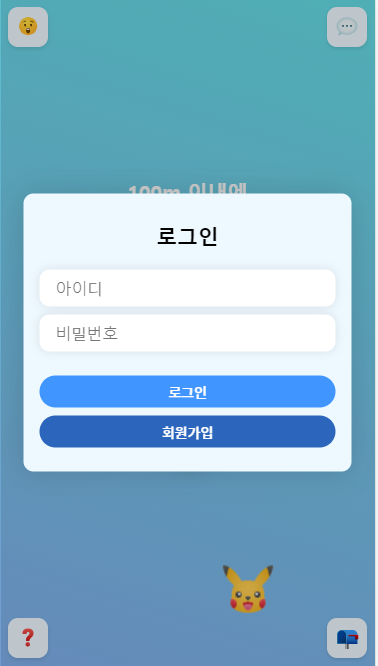 | 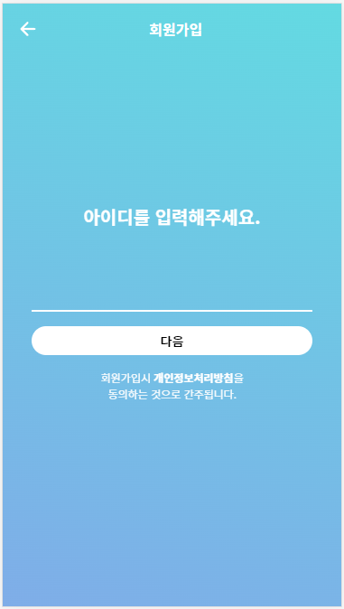 | 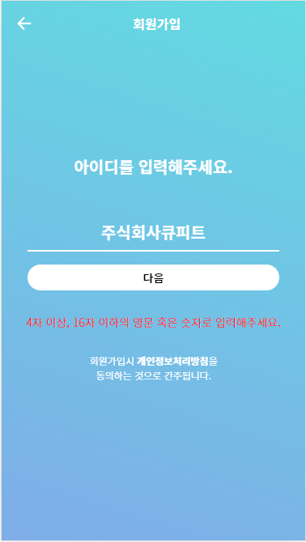 | 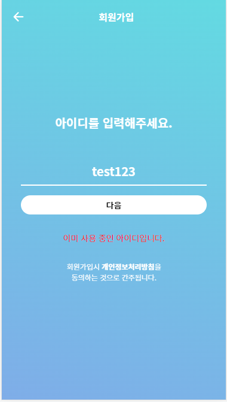 | 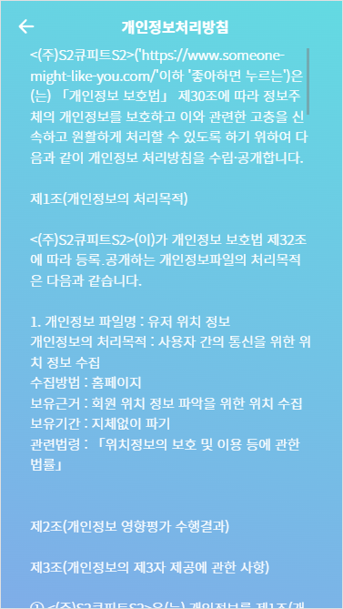 |
| ------------------------------------------ | ------------------------------------------------------------ | ------------------------------------------------------------ | -------------------------------------------------- | ------------------------------------------------------ |
| 로그인                                     | 회원가입                                                     | 아이디조건안내                                               | 아이디중복확인                                     | 개인정보처리방침                                       |

|  | 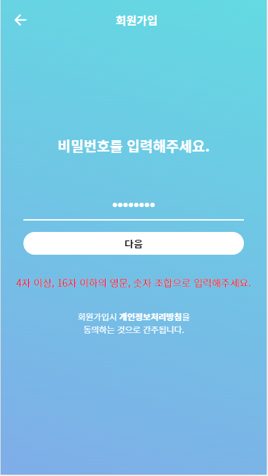 | 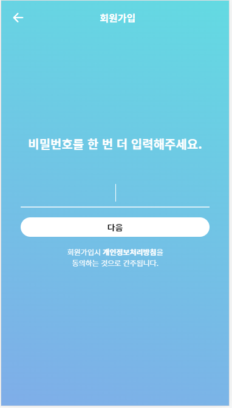 | 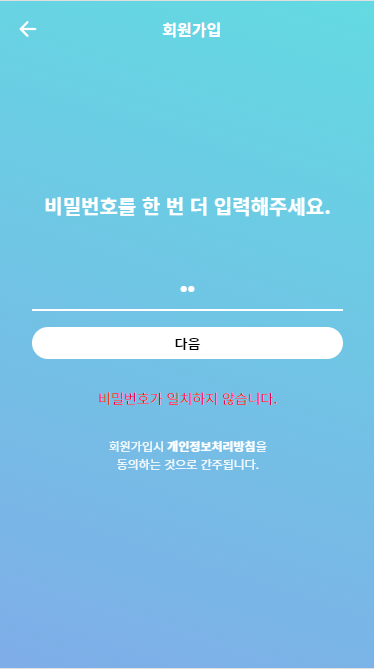 |  |
| ---------------------------------------------- | ------------------------------------------------------ | ---------------------------------------------- | -------------------------------------------------- | -------------------------------------------------- |
| 비밀번호 설정                                  | 비밀번호조건안내                                       | 비밀번호 재확인                                | 비밀번호불일치                                     | 회원가입 완료                                      |

