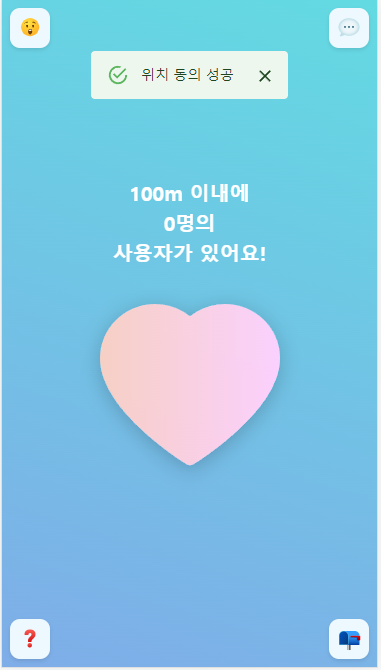
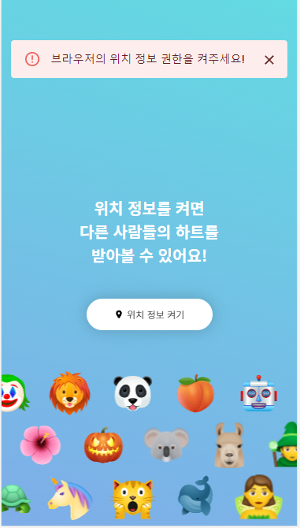
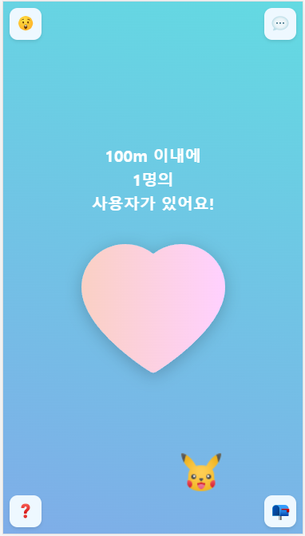
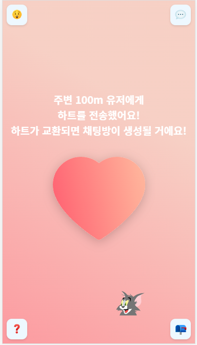
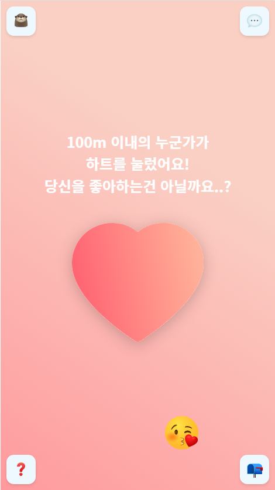

# 좋아하면 누르는 시연 시나리오

## 서비스 소개

| 주요 기능                                | 설명                                                         |
| ---------------------------------------- | ------------------------------------------------------------ |
| 🌍 주변 100m이내 접속 유저 위치 탐색 기능 | 주변 100m 이내의 사용자를 찾기 위해 위치 정보 동의를 받아야 합니다. |
| 💌 사용자 간의 하트 송수신                | 100m이내의 유저들과 하트를 주고 받을 수 있습니다. 만약 서로 하트를 주고받은 유저가 있다면, 익명 채팅창이 자동 생성됩니다. |
| 🐶 자신의 이모지 설정, 변경 기능          | 나의 정체성을 드러내는 이모지를 설정, 변경 가능합니다. 설정된 이모지로 다른 사용자 화면에 나타납니다. |
| 🙋‍♀️ 실시간 채팅 기능                      | 생성된 채팅방에서 채팅을 송수신할 수 있습니다.               |
| 🚨 유저 신고                              | 서비스를 이용하면서 불쾌감을 주는 유저를 신고할 수 있습니다. 신고 후 채팅방은 블라인드 처리되어 사용자들에게 제공되지 않습니다. |

## location 위치 정보 동의

좋아하면 누르는 서비스는 위치 정보를 활용한 서비스이기에 유저의 위치 정보를 받아야 합니다. 

|  |  |  |
| ------------------------------------------------------ | -------------------------------------- | -------------------------------------- |
| 위치정보켜기버튼클릭                                   | 동의성공                               | 동의실패                               |

## Main

유저는 비로그인 상태에서도 근처에 접속한 유저를 볼 수 있지만 메인 화면의 기능(채팅방, 이모지변경)을 사용하기 위해 로그인/회원가입이 필요합니다.

|                                        |  |  |
| ------------------------------------------------------------ | ------------------------------------------------ | ------------------------------------------------------------ |
| Main 화면 - 100m 이내의 사용자 수 만큼 설정된 이모지가 나타난다. | 하트 보냈다                                      | 하트를 받았다                                                |
 
## Emoji

